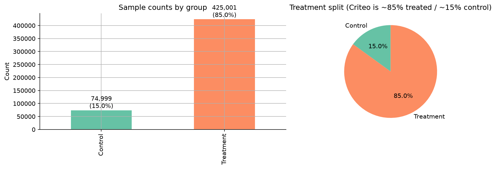
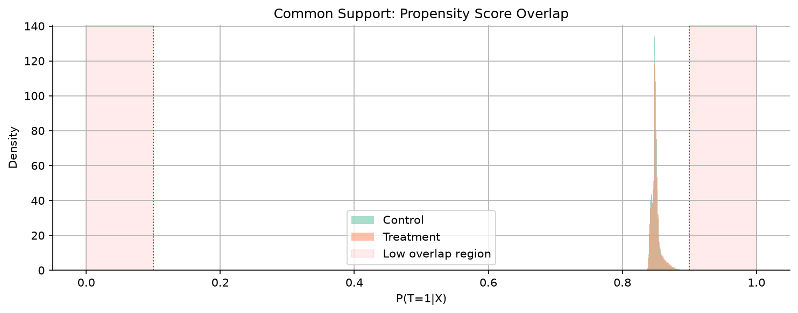
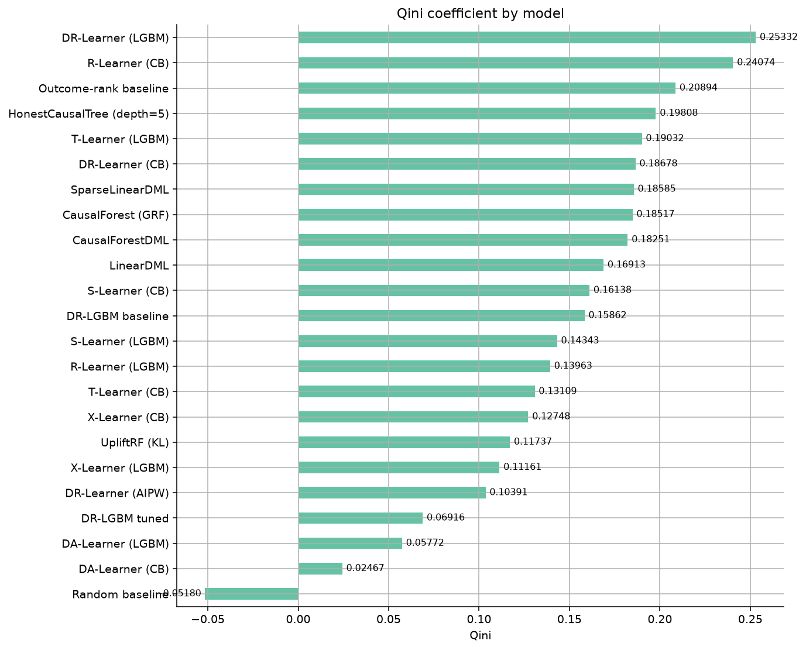
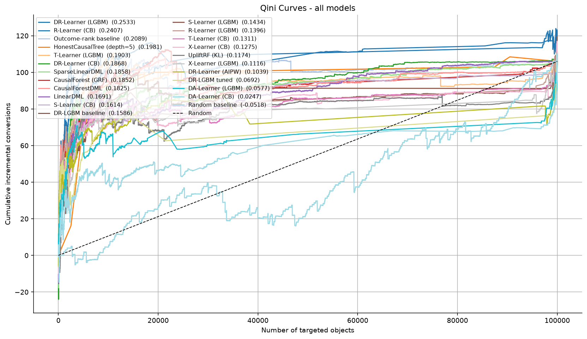
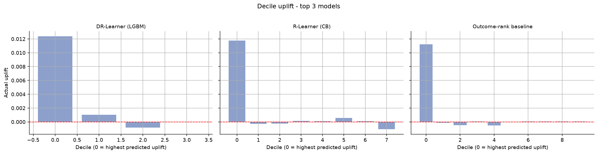
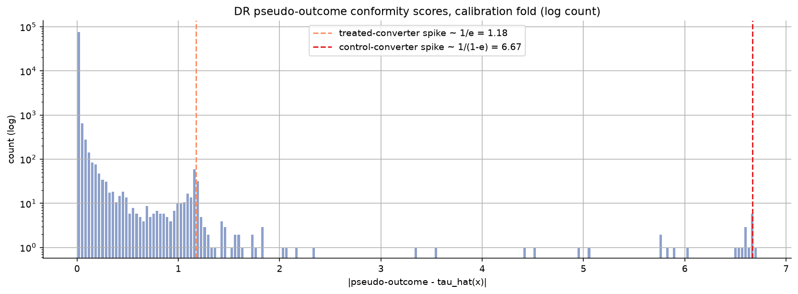
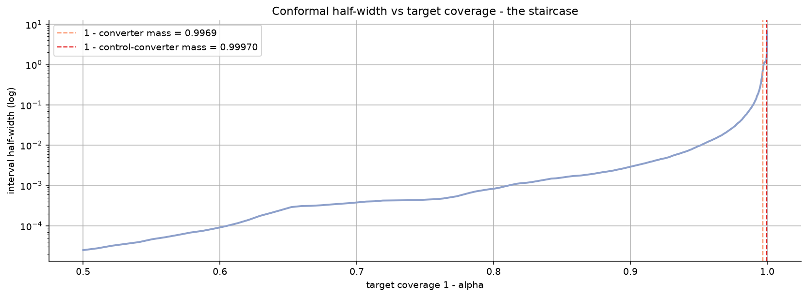

# Criteo Uplift Modeling - Benchmarks

A reproducible benchmark of uplift-modeling approaches on the [Criteo Uplift Prediction Dataset](https://ailab.criteo.com/criteo-uplift-prediction-dataset/) (~13.98M rows, 12 anonymized features `f0..f11`, randomized treatment offer, binary conversion outcome).

> **Status: executed end-to-end** on a 500K-row sample (20% hold-out, seed 42). The numbers below are this repo's actual results, not literature values. They will shift with sample size and seed - treat the ranking as illustrative, and read notebook 06's bootstrap tiers rather than the raw point ordering. See [Caveats](#caveats).

Covered approach families:

- **Meta-learners** (causalml) - S, T, X, R, DR - with LightGBM and CatBoost base learners
- **Domain-adaptation learner** (econml `DomainAdaptationLearner`) - the "DA" row
- **Tree-based causal methods** - Uplift Random Forest / KL (causalml), Causal Forest / GRF (econml), Honest Causal Tree (econml)
- **Double Machine Learning** (econml) - LinearDML, SparseLinearDML, CausalForestDML
- **Advanced** - DragonNet (causalml, needs TensorFlow), DR-AIPW ATE with influence-function CI (causalml), DMLIV for LATE (econml)
- **Hyperparameter optimization** - Optuna TPE on DR-loss pseudo-outcomes
- **Conformal prediction** - split conformal on DR pseudo-outcomes (conformal meta-learners) for finite-sample individual-treatment-effect intervals

## Project layout

```
00_eda.ipynb              - loading, EDA, propensity/overlap check, SHAP HTE drivers
01_meta_learners.ipynb    - S / T / X / R / DR × {LightGBM, CatBoost} + DA (econml) + outcome-rank baseline
02_tree_methods.ipynb     - Uplift RF (causalml), Causal Forest (GRF), Honest Causal Tree
03_dml.ipynb              - LinearDML, SparseLinearDML, CausalForestDML
04_advanced.ipynb         - DragonNet, DR-AIPW ATE CI, DMLIV (LATE)
05_hpo.ipynb              - Optuna + DR-loss; baseline vs tuned
06_benchmark.ipynb        - leaderboard, bootstrap Qini CIs + tiers, ERUPT policy value, Qini curves
07_conformal.ipynb        - conformal prediction intervals for individual treatment effects (standalone)

METRICS.md  - AUUC, Qini, Uplift@k, DR-loss / R-loss, ERUPT, CIs
RESEARCH.md - dataset facts, literature, best practices, pitfalls
```

## Quick start (uv)

This project uses [uv](https://docs.astral.sh/uv/) for dependency management.

```bash
uv sync                       # create .venv and install from pyproject.toml + uv.lock
uv run jupyter lab            # launch Jupyter in the project environment

# DragonNet (notebook 04) additionally needs TensorFlow. Its pins conflict with
# the locked stack on Python 3.12, so install it separately if you want it:
uv pip install "tensorflow>=2.16"
```

Run the notebooks in order. Each of `01`-`05` writes its results to `artifacts/*.pkl`; `06_benchmark.ipynb` loads all artifacts and builds the final leaderboard. `07_conformal.ipynb` is standalone (it loads the dataset directly and needs no artifacts). `artifacts/`, generated PNGs, and `leaderboard.csv` are git-ignored (reproducible outputs).

## Data

Criteo disabled the S3 bucket that `sklift.datasets.fetch_criteo` downloads from (it now returns HTTP 403), so the stock loader no longer works. The notebooks instead import `fetch_criteo` from the local [`criteo_data.py`](criteo_data.py), which pulls the same file from the official [Hugging Face mirror](https://huggingface.co/datasets/criteo/criteo-uplift) (byte-identical, same MD5) and returns the same object. The ~297 MB file is cached under `~/scikit-uplift-data/` and downloads once on first run. No manual step is needed.

## Conventions

- All code, comments, and prose in English.
- `SEED = 42`, `SAMPLE_SIZE = 500_000` for prototyping; set `SAMPLE_SIZE = None` for the full ~14M-row run (recommended for the final leaderboard - see caveats).
- Splits are stratified on `(treatment × conversion)`; the (control, converted) cell is the scarcest (~0.03% of rows).
- A fixed stratified-random 20% hold-out (seed=42) is never used during HPO.
- HPO objective: DR-loss (doubly-robust pseudo-outcome MSE) - see [METRICS.md §2.2](METRICS.md).
- Final model selection: Qini AUC on the hold-out, read via bootstrap CIs / tiers (notebook 06), not a raw point-estimate ordering.

## Dataset

```python
from criteo_data import fetch_criteo   # local drop-in; sklift's S3 URL is dead (403)
ds = fetch_criteo(target_col='conversion')
# 13.98M rows | 12 features f0..f11 | treatment (offer) / conversion
# `.data` holds features only; `exposure` is reached via treatment_col='exposure' or 'all'
```

- `treatment` - ad offered (randomized; valid instrument Z). Skewed **~85% treated / 15% control** (treatment ratio ≈ 0.85) - an unequal-allocation RCT, not 50/50.
- `exposure` - ad actually viewed (endogenous treatment T); load with `treatment_col='all'`.
- `conversion` - binary outcome Y. Overall CR ≈ 0.29% (control ≈ 0.22%, treated ≈ 0.30%).
- ATE ≈ +0.08 pp on the full data (relative lift ~+35-40%); on the 500K sample used here the diff-in-means is ≈ +0.12 pp - sampling variation, see notebook 00.
- The pair (`treatment`, `exposure`) supports an IV / LATE analysis under one-sided non-compliance (notebook 04).



*Unequal-allocation RCT: ~85% treated, ~15% control (500K sample). Control is the scarce arm and dominates the evaluation variance.*



*Common support: cross-fitted propensity sits in a tight band around P(T=1|X) ~ 0.85 (min 0.82, max 0.93, sd 0.007), matching the 85% treatment ratio. About 0.08% of scores edge past 0.9 (the small tail crossing the right marker); none reach the [0.01, 0.99] clip bounds used by the models, so overlap holds and clipping never binds here.*

## Which library provides what

| Package | Role in this project |
|---------|----------------------|
| **scikit-uplift** | metrics (`qini_auc_score`, `uplift_auc_score`, `uplift_at_k`, `qini_curve`) and uplift plots (dataset now loaded via `criteo_data.py`) |
| **causalml** | meta-learners (S/T/X/R/DR), Uplift Random Forest (`inference.tree`), DragonNet |
| **econml** | DML (Linear/SparseLinear/CausalForestDML), Causal Forest (`grf`), DMLIV, `DomainAdaptationLearner` (DA) |
| **lightgbm / catboost** | base learners |
| **optuna** | HPO (notebook 05) |
| **shap** | HTE feature importance (notebook 00) |

## Key takeaways (this repo's executed results, 500K sample)

The main finding is that the leaderboard is mostly noise at this sample size. The 20% hold-out has only ~300 conversions, so Qini estimates are wide and most models are statistically tied.

| Model (top of leaderboard) | Qini | 95% bootstrap CI |
|---|---|---|
| DR-Learner (LightGBM) | 0.253 | [0.108, 0.395] |
| R-Learner (CatBoost) | 0.241 | [0.125, 0.379] |
| Outcome-rank baseline | 0.209 | [0.173, 0.242] |
| HonestCausalTree | 0.198 | [0.105, 0.288] |

- The ranking is not significant: the leader (DR-Learner, LightGBM, Qini 0.253) beats the runner-up in only ~59% of bootstrap resamples, and 18 of 22 models fall inside its "top tier" (not beaten in ≥97.5% of resamples). Read tiers, not the point ordering.
- The outcome-rank baseline (Qini 0.209) beats most real uplift models. Plain "target by predicted P(Y=1|X)" is hard to beat on this dataset.
- The textbook ranking DR > R > X > T > S does not hold: the base learner matters more than the recipe. R-Learner is 2nd with CatBoost (0.241) but near the bottom with LightGBM (0.140), and both X-Learners sit at the bottom.
- Policy value (ERUPT) is within noise: the best top-20% policy value (~0.00335) sits just above treat-all (~0.00325) and treat-none (~0.00200), but the gap to treat-all is smaller than the estimator's standard error at ~300 conversions. This run does not establish that targeting beats blanket treatment; a larger hold-out is needed to rank policies.
- Top outcome-model features by LightGBM gain: f11, f4, f8, f2. These are the natural candidates for the heterogeneity analysis.

Leaderboard, all Qini curves, and decile uplift for the top 3 models (hold-out, 500K sample):







The curves make the "mostly noise" point visible: the top ~18 models form one overlapping band, well above the random diagonal but not cleanly separable from each other; only the two DA-Learners and the tuned DR-LGBM trail clearly. In the decile plots all three leaders put the real uplift in the top decile and sit flat-to-negative elsewhere - the ranking signal is thin and lives at the very top.

### Uncertainty of individual effects (notebook 07)

Point predictions are only half the story. `07_conformal.ipynb` builds finite-sample, distribution-free prediction intervals for the individual treatment effect via split conformal on doubly-robust pseudo-outcomes (conformal meta-learners; no weighting is needed under the randomized 85/15 design). The honest finding on a rare binary conversion: the marginal coverage guarantee holds but is nearly vacuous. Because `P(ITE = 0) >= 1 - p1 - p0 ~ 99.5%`, the trivial interval `{0}` is already "valid" at any conventional level, and a semi-synthetic check with known ground-truth strata shows marginal ITE coverage sitting on nominal (0.91 at the 90% level) while coverage on the affected units - the persuadables and sleeping dogs - is exactly zero.





The pseudo-outcome scores form four spikes (top): 99.7% are tiny, and the rare converters sit at `~1/e` and `~1/(1-e)`. Interval width then follows a staircase (bottom): it stays a few thousandths wide until the target coverage crosses the converter mass (~99.7%), then jumps to ~1.2 and ~6.7 - step heights set by the `1/e` and `1/(1-e)` factors of the 85/15 design, not by the model. The verifiable guarantee (pseudo-outcome coverage) tracks nominal throughout; for individual-level uncertainty on rare binary outcomes, group-level statements (bootstrap tiers, quantile-group ATEs) are what remain informative.

## What may be skipped at runtime

- DragonNet (04) needs TensorFlow (`uv pip install "tensorflow>=2.16"`); the notebook skips it otherwise and continues.
- DMLIV (04) needs the `exposure` column; the notebook loads it via `fetch_criteo(..., treatment_col='all')`.

## Caveats

- Results were produced at `SAMPLE_SIZE = 500_000`. The 20% hold-out then has only ~300 conversions, so Qini differences are noisy - notebook 06 quantifies this with bootstrap CIs, and the takeaway is that most models are statistically tied. For a publishable ranking, run on the full dataset (≥1M-row hold-out) and across several split seeds.
- DragonNet did not run in this pass (TensorFlow not installed); every other model did.
